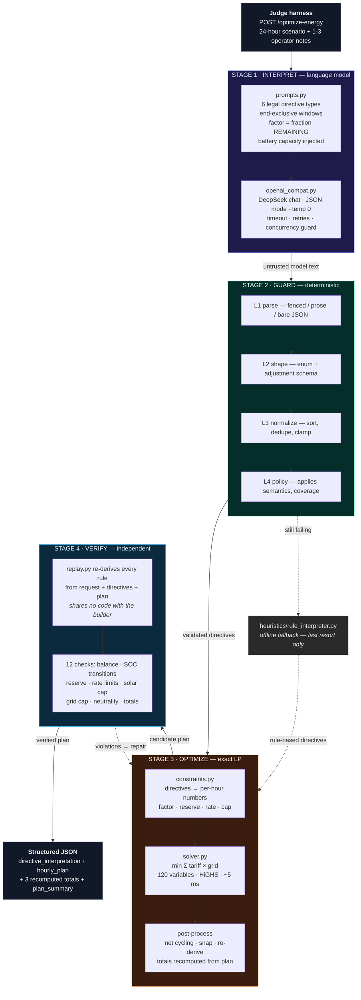
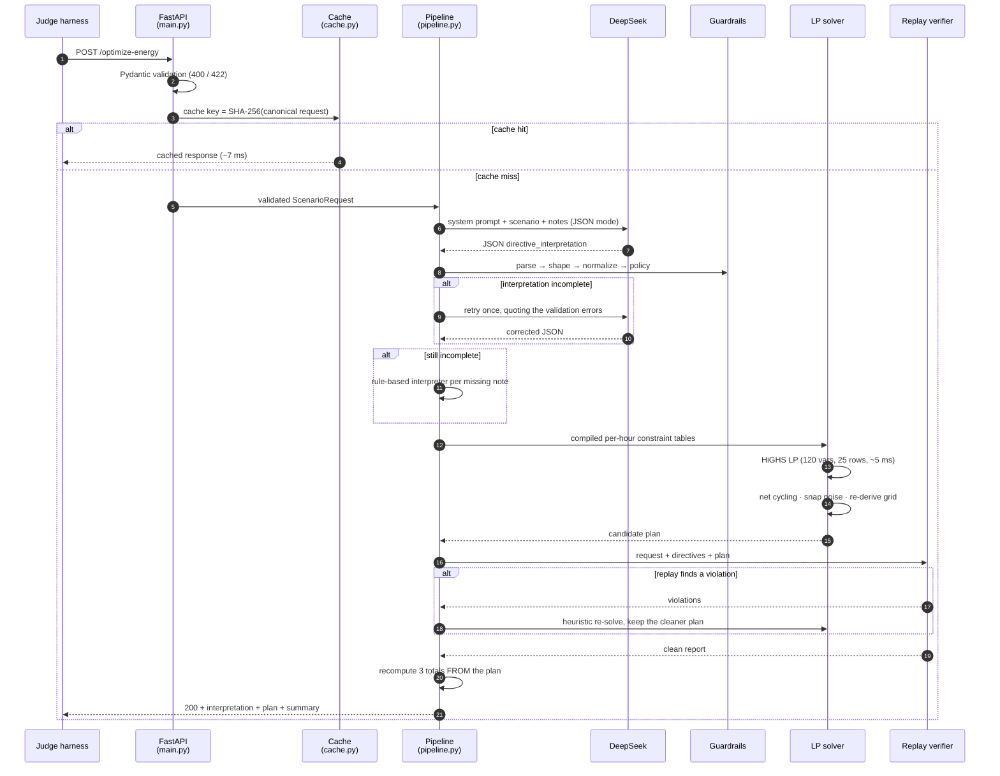
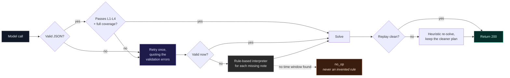
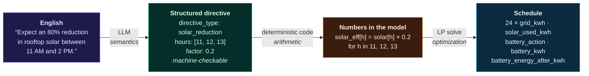
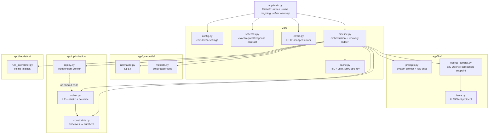
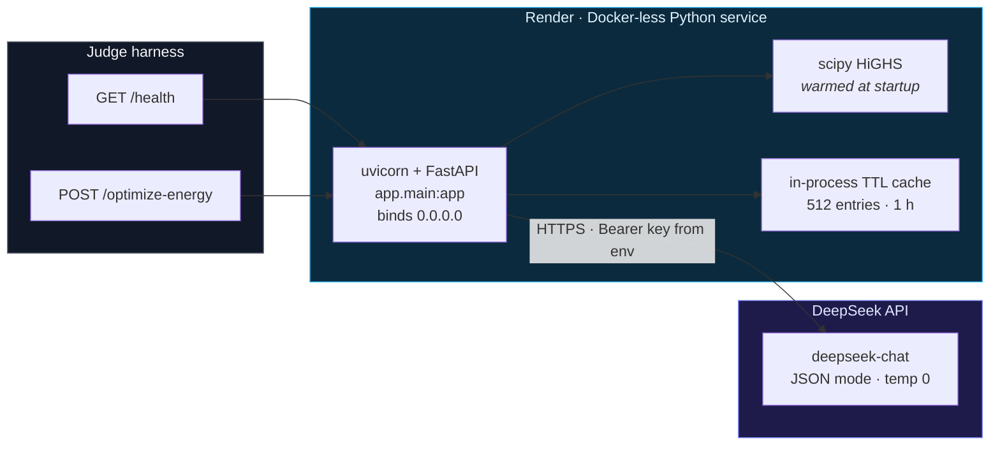

# GridWise — Architecture

**LLM-assisted operator directive interpretation with deterministic guardrails and exact 24-hour
cost optimization.**

One sentence: *a language model turns English operator notes into a fixed structured format,
deterministic code validates that format, and an exact linear program turns it into the cheapest
valid 24-hour schedule.*

---

## 1. End-to-end pipeline

**The central design rule:** *the optimizer never reads English, and the verifier never trusts the
optimizer.*

---

## 2. Request lifecycle

---

## 3. Recovery ladder

Every failure mode has exactly one defined next step, so a valid request never returns a 5xx.

---

## 4. What actually happens to the sentence

This is the diagram to dwell on in the video — it is the whole idea of the challenge.

Two traps live on that first arrow:

| Wording | Meaning | `factor` |
|---|---|---|
| "25% **of** the forecast" | remainder | `0.25` |
| "drop **to** 20%" | remainder | `0.20` |
| "an 80% **reduction**" | reduction | `0.20` |
| "reduce **by** 40%" | reduction | `0.60` |
| "about **half**" | fraction | `0.50` |

And one on the second arrow: windows are **start-inclusive, end-exclusive**, in whole hours —
`11 AM to 2 PM` → `[11, 12, 13]`, never `[11, 12, 13, 14]`.

---

## 5. Module map

Note the dotted edge: `replay.py` deliberately imports **nothing** from `constraints.py` or
`solver.py`. If the builder and the checker shared a helper, a bug in that helper would be
invisible to both.

---

## 6. Deployment topology

---

## 7. Design invariants worth stating on camera

| # | Invariant | Why it matters |
|---|---|---|
| 1 | Every directive is a **constraint modification**, never an objective change | The objective is always `Σ tariff × grid`, so one LP builder is correct for every scenario |
| 2 | The LP is **exact** — no binaries needed | The *netting lemma*: subtracting `min(charge, discharge)` from both preserves SOC trajectory, all bounds, all rate limits, neutrality and cost. So every LP optimum has a cost-equivalent cycling-free schedule |
| 3 | The optimizer **never reads English** | Directives are compiled to numbers first, so the solver cannot be prompt-injected or invent a rule |
| 4 | The verifier is a **separate implementation** | It re-derives rules from `(request, directives, plan)`; it catches builder bugs |
| 5 | Totals are **recomputed from `hourly_plan`** | A listed critical violation is "reported totals disagree with hourly_plan" — structurally impossible here |
| 6 | Failure is **staged, never fatal** | Model outage → retry → rule fallback → no_op; infeasible model → elastic → heuristic |

---

## 8. Three-minute narration script

Target **180 s**. Speak at a calm pace; each block maps to one on-screen element.

### 0:00 – 0:22 · Problem (22 s)
> *On screen: the "English → Structured → Numbers → Schedule" strip (§4).*
>
> "BUP operates a campus on grid power, rooftop solar, and a battery. We get the next 24 hours of
> demand, solar and tariff, plus one to three notes written by a human operator. Our job is to
> understand those notes, apply them as hard rules, and return the cheapest valid 24-hour schedule.
> The catch is that notes are English and the optimizer needs mathematics."

### 0:22 – 0:45 · Architecture overview (23 s)
> *On screen: the four-stage pipeline (§1).*
>
> "So we built a four-stage pipeline. Stage one, a language model reads the notes. Stage two,
> deterministic guardrails validate what it produced. Stage three, an exact linear program finds the
> cheapest plan. Stage four, an independent verifier replays that plan against every rule. The
> guiding principle is that the optimizer never reads English, and the verifier never trusts the
> optimizer."

### 0:45 – 1:20 · Stage 1 — the LLM (35 s)
> *On screen: §4 with the percentage table and the window rule.*
>
> "The model is mandatory in this path and it does real semantic work. It has to map free text onto
> exactly six directive types. Two traps decide the score. First, percentages are ambiguous:
> '25% of the forecast' means the remainder is 0.25, but 'an 80% reduction' means the remainder is
> 0.2 — the inversion of the same number. Second, time windows are start-inclusive and
> end-exclusive, so '11 AM to 2 PM' is hours 11, 12 and 13, not 14. We also hand the model the
> battery capacity, because 'hold 50% of capacity' cannot be resolved without it.
> We ask for strict JSON at temperature zero, with a prompt that teaches these conventions."

### 1:20 – 1:50 · Stage 2 — guardrails (30 s)
> *On screen: recovery ladder (§3).*
>
> "Model output is treated as untrusted until it passes four layers. Layer one parses JSON out of
> fences or surrounding prose. Layer two checks the shape: legal directive type, correct fields for
> that type, one entry per note in index order. Layer three repairs what is merely sloppy —
> unsorted hours, duplicates, a factor above one — and rejects what is structurally wrong, because
> silently guessing a constraint is worse than admitting we failed. Layer four enforces the
> `applies` semantics. If anything fails we retry once, quoting the errors back to the model, and
> if it still fails we fall back to a rule-based interpreter — never to an invented rule."

### 1:50 – 2:25 · Stage 3 — optimization (35 s)
> *On screen: the LP formulation.*
>
> "Every directive is a constraint change, never a change to the objective — the objective is always
> to minimise the sum of grid energy times tariff. So the model family is fixed and one builder
> handles every scenario: ninety-six variables, twenty-five equality rows, solved by HiGHS in about
> five milliseconds. We do not need integer variables, and that is provable. If a solution charges
> and discharges in the same hour, subtracting the smaller from both leaves the state of charge, all
> bounds, all rate limits and the cost unchanged — so any optimum has an equivalent cycling-free
> schedule. That is why we get a globally optimal, not merely good, plan."

### 2:25 – 2:45 · Stage 4 — verification and evidence (20 s)
> *On screen: §1 footer plus the evidence chips.*
>
> "Stage four replays the finished plan hour by hour against energy balance, battery bounds, rate
> limits, effective solar, grid caps and end-of-day neutrality. It is a separate implementation
> from the solver on purpose — it exists to catch our own bugs. And it did: during development it
> caught a missing reserve constraint that had quietly made all ten public cases look cheaper than
> the reference."

### 2:45 – 3:00 · How to run and test (15 s)
> *On screen: quickstart commands.*
>
> "The repository ships a self-contained quickstart, seventy-four unit tests, and two tools: one
> verifies our optimum against all ten public reference cases — we match them exactly — and a
> fifty-case suite runs against the deployed endpoint. Health endpoint, then POST to
> `/optimize-energy`. Everything is reproducible from the README."

---

## 9. Slide plan (if you prefer slides over a screen recording)

| Slide | Content | Duration |
|---|---|---|
| 1 | Title + one-sentence problem | 8 s |
| 2 | English → Structured → Numbers → Schedule | 14 s |
| 3 | Four-stage pipeline (§1) | 23 s |
| 4 | The two semantic traps: percentage inversion + end-exclusive windows | 35 s |
| 5 | Recovery ladder (§3) | 30 s |
| 6 | LP formulation + netting lemma | 35 s |
| 7 | Independent replay verifier + the bug it caught | 20 s |
| 8 | Evidence: 10/10 exact optima, 50/50 deployed, p95 1.2 s | 15 s |

---

## 10. Rendering the diagrams

* **GitHub / VS Code**: the Mermaid blocks above render natively in `docs/ARCHITECTURE.md`.
* **Video capture**: open `docs/architecture.html` in any browser. It is fully self-contained — no
  CDN, no network, no build step — so it cannot fail mid-recording.
* **Export to PNG/SVG**: VS Code's Markdown preview → right-click a diagram → copy as image, or use
  the Mermaid Live Editor with the same blocks.
